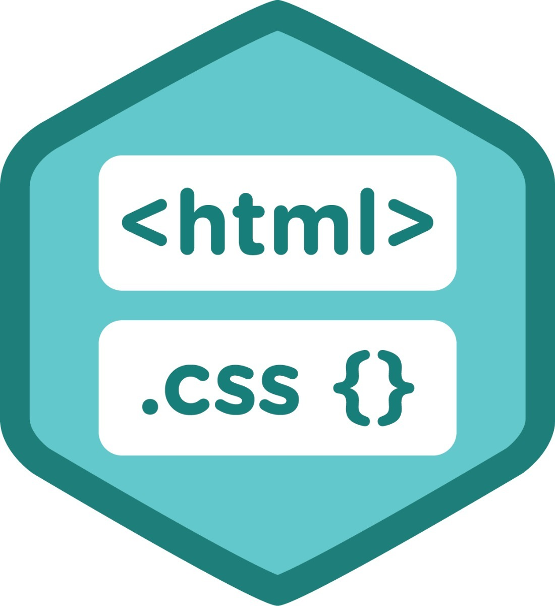

 #exercicio_teste 

              HTML e CSS 

 

 

 ## HTML  
 Abreviação para a expressão inglesa HyperText Markup Language, que significa Linguagem de Marcação de Hipertexto. Trata-se de uma linguagem de marcação utilizada na construção de páginas na Web. Documentos HTML podem ser interpretados por navegadores.
<b></b>

 ## CSS 
 É a sigla para Cascading Style Sheet que, em português, significa Folha de Estilo em Cascatas. É uma linguagem de estilos que serve para compor a parte visual das páginas na internet.  
<b></b>

 Markdown (https://www.treinaweb.com.br/blog/comandos-do-git-que-voce-precisa-conhecer-parte-1/)

 <b></b>

   

 <b></b>    

 Por Inácia Simone

 
     

   
